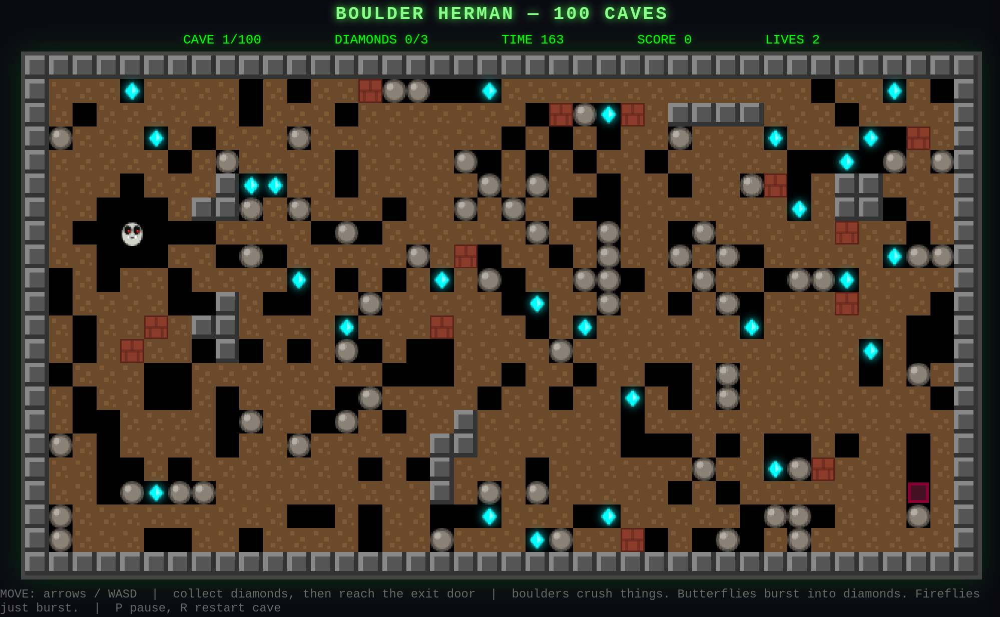

# HermanVibeSlop

**Boulder Herman** — a Boulder Dash-style game with 100 procedurally generated caves.

That's right: one hundred. Every single one of them conjured out of thin air by an algorithm, which means no two playthroughs feel quite the same, and every so often the cave generator hands you something genuinely mean. You've been warned.

## Play

Open `index.html` in a browser and you're off — no build step, no server, no ceremony. If your browser is the suspicious type and blocks ES modules on `file://` (some do), just run:

```
python3 -m http.server
```

and mosey on over to http://localhost:8000.

The game grows with your window, but only in whole-number multiples of its native
size — 2x, 3x, whatever fits — so the pixels stay razor sharp. No blurry
fractional stretching in this cave.

## A taste of the caves



Herman contemplates his next move in cave 1. That's him in the corner — the pale
fellow with the purple lips, the grin that has seen things, and the nose he is
very proud of. See the cyan diamonds? He wants those.
See the boulders hanging around overhead? Those want *him*. This is the whole game,
really: a series of increasingly poor decisions about gravity.

## Controls

- **Move:** arrow keys or WASD. Herman digs where he walks.
- **SPACE:** start the game, keep going, next cave. The universal "yes" button.
- **C:** pick up right where you left off in a saved game.
- **P:** pause. Coffee breaks are allowed.
- **R:** restart the cave. We won't judge. Much.

## Rules

Dig through dirt. Shove boulders around like you own the place. Collect diamonds until the exit door deigns to open, then stroll through it like the champion you are.

Fair warning: physics doesn't care about your feelings. Boulders fall, and falling boulders crush things — you, fireflies, butterflies, anything standing in the wrong spot. The butterflies have a party trick, though: pop one and it bursts into diamonds. Decide for yourself whether that makes it better or worse.

## Structure

For the curious and the code-inclined:

- `index.html` — the page shell and HUD
- `styles.css` — all the pretty
- `src/engine.js` — the brain: pure game logic. Cave generation, physics, enemies, movement. Zero DOM, zero drama.
- `src/main.js` — the face: rendering, input, and the game state machine that keeps it all honest
- `tiles/` — every 16x16 sprite as an editable PNG, plus the palette
- `tools/tiles_io.py` — bake your tile edits into the game (see `tiles/README.md`)
- `assets/cave_bg.gif` — the animated mossy-rocks-and-water background
- `tools/make_background.py` — regenerate that background

Feeling artistic? Every sprite in the game is a 16x16 PNG you can redraw in
LibreSprite — Herman's creepy purple-lipped face included. Edit a tile, run one
command, and your art is in the game.
