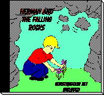
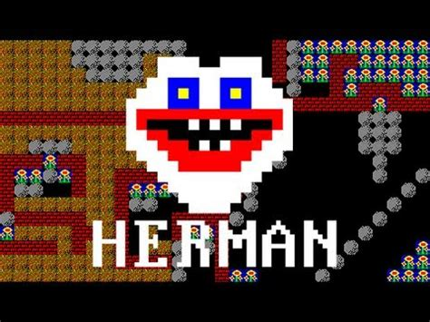

# Bouldering Herman and the Sloppy Rocks

This is a Boulder Dash-style game with 100 procedurally generated caves, but it's actually a fan game inspired by Herman and the Falling Rocks for Windows 3.x developed by CARMACON, Inc. who incredibly still has an active website where you can...mail order your full release physical game after enjoying the Shareware (demo) release from 1992. Just click on the amazing box art:

https://www.mobygames.com/game/233178/herman-and-the-falling-rocks/

That concept is the base I'm working with and I'll add some more features beyond what the 1992 original was capable of in my vibe slop edumacation journey, and probably end up going too far in a couple places.

Check out LGR's game review for more historical context:

Procedural generation of course, which means no two play-throughs feel quite the same. The more caves you clear, the harder and meaner the cave generator gets. To a point anyway and this is WIP. I'm focused on making that curve actually fun, it's roughly sketched in currently.

## Play

Releases page for Linux AppImage and Windows executable, or download the repo and open index.html.

The game screen integer scales with your window. No fractional scaling in this cave.

## Development

This whole game is an experiment in creating with French tier AI while barely qualifying as a script kiddie: each revision below came
out of the same loop — describe the change, let the agent make it, play the caves, decide what's next.

<table>
  <tr>
    <td align="center"></td>
    <td align="center"></td>
    <td align="center"></td>
  </tr>
  <tr>
    <td align="center">revision 1</td>
    <td align="center">revision 2</td>
    <td align="center">revision 2-2</td>
  </tr>
  <tr>
    <td align="center"></td>
    <td align="center"></td>
    <td align="center"></td>
  </tr>
  <tr>
    <td align="center">revision 3-1</td>
    <td align="center">revision 3-2</td>
    <td align="center">revision 4-1</td>
  </tr>
</table>

## Controls

- **Move:** arrow keys or WASD. Herman digs where he walks.
- **SPACE:** the universal "yes" — pick menu items, start, retry, keep going, next cave.
- **P** (or **ESC**): pause. The pause menu offers a resume or a clean quit back to the title.
- **R:** restart the cave. We won't judge. Much.
- **Menus:** navigate with the movement keys. LEVEL SELECT is a numpad grid. The AUDIO screen tunes music, sound and footsteps, and its SOUND TEST row steps through every sound file in the game by name.

**Gamepads work too** (XInput and DirectInput): stick or D-pad moves and navigates, **A** is SPACE, **B** is ESC, **Start** pauses, **Select** restarts the cave. Plug in and press any button.

## Gameplay Description:

Dig through dirt, avoid boulders and other surprises. Collect flowers until the exit door deigns to open, and descend. The doors ask for more flowers the deeper you go — and eventually they demand three keys on top of it, so keep your eyes open.

A locked door is gray. When you've unlocked a door it will flash yellow, or flashing red with its key slots the moment you can actually walk through it.

A word on boulders because they have rules. Dig out the dirt under one and stand
there, and it will hover over your head politely waiting. Step out from under it,
though, and it drops with a rumble while it rolls and a thud when it lands. If the rock
perches on something round (Flowers count as round) it tries to slide off sideways/diagonal, and if a falling boulder
crushes you, that's a SPLAT.

The Butterflies have a party trick: pop one with a boulder and it'll bursts into
flowers. Fireflies are aggressive and give you nothing but trouble. Decide for yourself risk/reward.

## Feeling Artistic?

Every sprite in the tiles folder is a 16x16 PNG you can redraw in
LibreSprite — Herman's creepy... purple? lipped face included. Edit a tile, run one
command, and your art is in the game.
